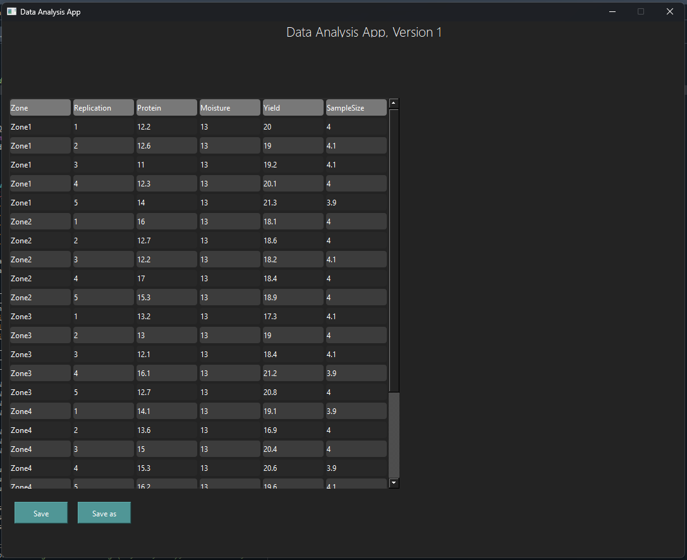

# PyQt6-DataWizard

## Introduction
Welcome to PyQt6-DataWizard! This repository serves as a step-by-step guide to mastering PyQt6 through progressive examples, from basic data handling to advanced machine learning integration. Each version builds upon the last, introducing new features and complexities in a structured manner. Whether you're a beginner looking to learn PyQt6 or a professional seeking to enhance your skills, these examples are crafted to provide practical insights into PyQt6 applications.

## Installation and Setup
To get started, ensure you have Python 3.8 or higher installed. Install the following required packages to work with the examples in this repository:

```bash
pip install pyqt6
pip install pandas
pip install matplotlib
pip install scikit-learn  # For machine learning integration
```
## Screenshots

Below are screenshots from each version of the project, giving you a glimpse into the progression and features added at each step.

<a href="V1_BasicDataHandling"></a>

