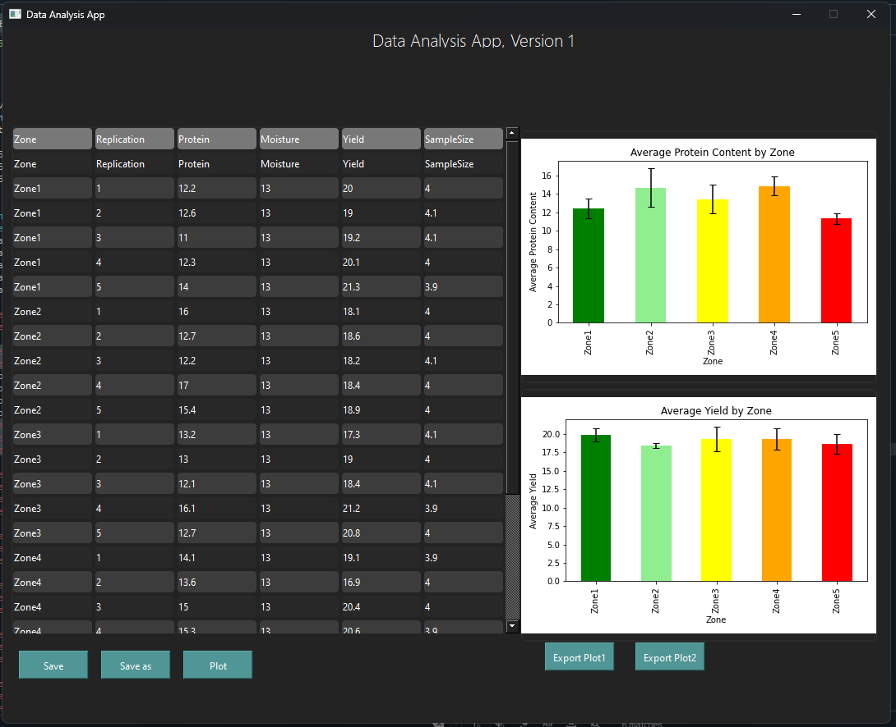
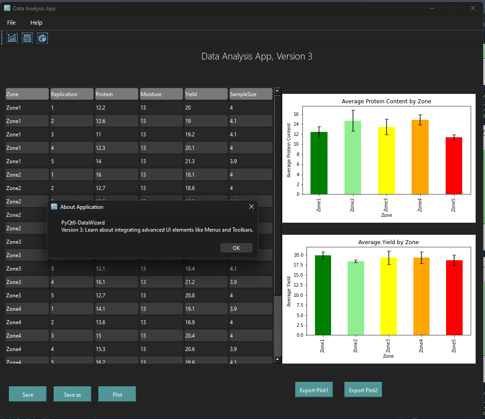
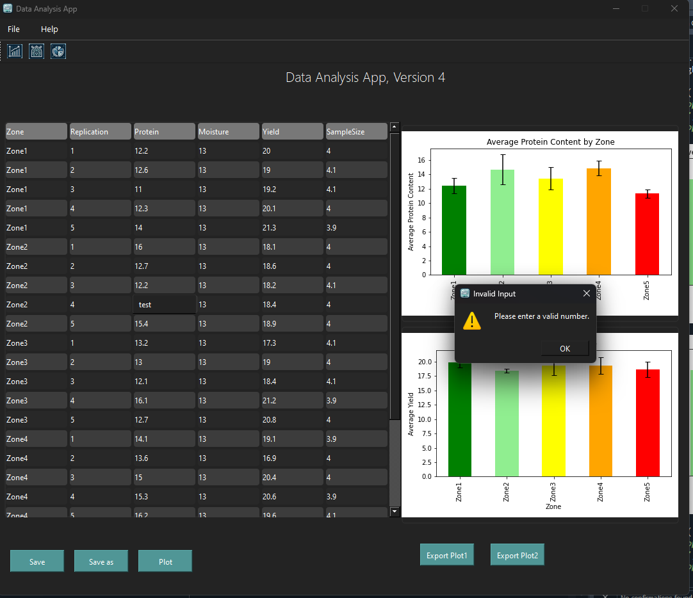
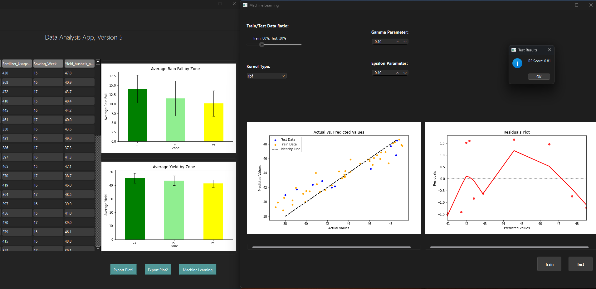
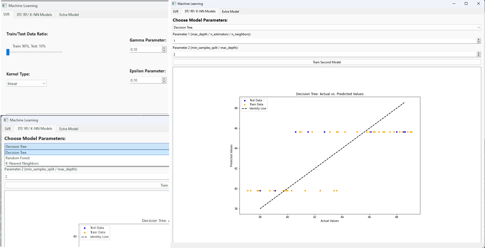

# PyQt6-DataWizard

## Introduction
Welcome to PyQt6-DataWizard! This repository serves as a step-by-step guide to mastering PyQt6 through progressive examples, from basic data handling to advanced UI integrations with menus and toolbars, as well as machine learning integration. Each version builds upon the last, introducing new features and complexities in a structured manner. Whether you're a beginner looking to learn PyQt6 or a professional seeking to enhance your skills, these examples are crafted to provide practical insights into PyQt6 applications.

## Installation and Setup
To get started, ensure you have Python 3.8 or higher installed. Install the following required packages to work with the examples in this repository:

```bash
pip install pyqt6
pip install pandas
pip install matplotlib
pip install scikit-learn  # For machine learning integration
```

## Repository Structure

This repository is organized into several folders, each representing a different version of the application to demonstrate the progressive complexity of using PyQt6:

- **Versioned Folders**:
  - `V1_BasicDataHandling`: This folder contains examples and utilities for basic data handling functionalities, including reading and writing CSV files.
  - `V2_DataVisualization`: Dedicated to showcasing how to visualize data using PyQt6, integrating various charting libraries.
  - `V3_MenuToolbarIntegration`: Focuses on enhancing the user interface with advanced menus and toolbars, and integrating icons from the graphics folder to improve navigation and aesthetics.
  - `V4_DataValidation`: This version introduces data validation capabilities within the application. It utilizes `QStyledItemDelegate` to ensure that input fields within tables accept only numeric values.
  - `V5_MachineLearning`: Expands the application's functionality by adding a machine learning module. This version includes a separate window that allows users to train and test Support Vector Regression models.
  - `V6_MachineLearningTabs`: Introduces a tabbed interface for performing multiple machine learning algorithms. Tab 1 focuses on SVR. Tab 2 allows users to select and configure Decision Tree, Random Forest, and K-NN models. Tab 3 is an empty tab for additional use cases.
  - More folders will follow as the application evolves to include more advanced features and integrations.

- **Tests Folder**: Contains unit tests for the project's various components, highlighting the importance of testing in ensuring that each part of the application functions as expected, thus maintaining robustness and reliability.

- **Screenshots**: Visual previews of each version are provided to give insights into the features developed in each stage of the project.
- **Screenshots**: The `graphics` folder contains a collection of icons and other graphical resources used throughout the PyQt6-DataWizard project. 


## Screenshots

Below are screenshots from each version of the project, giving you a glimpse into the progression and features added at each step.

<table>
  <tr>
    <td align="center">
      <a href="V1_BasicDataHandling">
        <br>
        Basic Data Handling
      </a>
    </td>
    <td align="center">
      <a href="V2_DataVisualization">
        <br>
        Data Visualization
      </a>
    </td>
  </tr>
  <tr>
    <td align="center">
      <a href="V3_MenuToolbarIntegration">
        <br>
        Menu Toolbar Integration
      </a>
    </td>
    <td align="center">
      <a href="V4_DataValidation">
        <br>
        Data Validation
      </a>
    </td>
  </tr>
  <tr>
    <td colspan="2" align="center"> <!-- This cell spans both columns -->
      <a href="V5_MachineLearning">
        <br>
        Machine Learning
      </a>
    </td>
  </tr>
   <tr>
    <td colspan="2" align="center"> <!-- This cell spans both columns -->
      <a href="V6_MachineLearningTabs">
        <br>
        Multi-Tab Machine Learning (SVR, RN, DT, K-NN)
      </a>
    </td>
  </tr>
</table>


## Star History

[](https://star-history.com/#gbazad93/PyQt6-DataWizard&Date)
